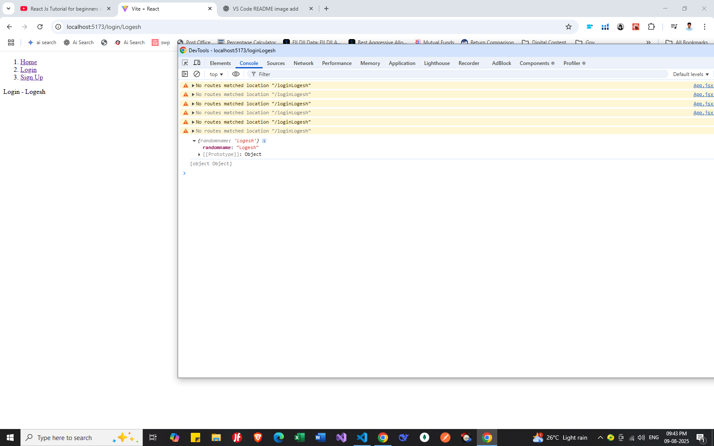
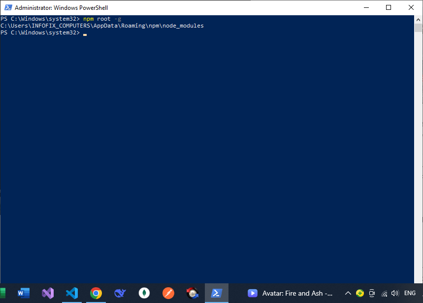
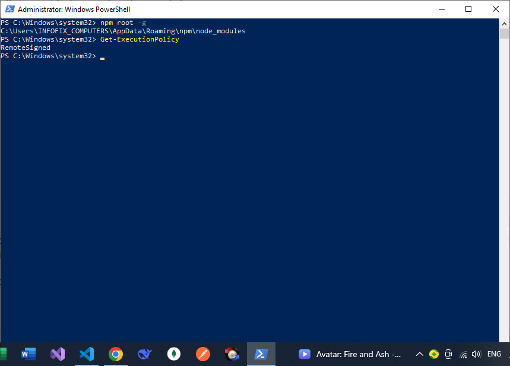

1.React Routing
npm install react-router-dom

2.UseParams
ethu property url erukkara value read panna use pannuvanga

2.UseNavigate
redirect panrathukku use pantranga in functions la

Link erukkula athu html tag redirect set panniye erukkum

3.UseEffect

useEffect(()=>{

}) without dependecy always call each render changess

useEffect(()=>{

},[]) only one time to load this page initial time

useEffect(()=>{

},[constvaribale]) if this const varibale any change automatically trigger

4.bootstrap include

npm install react-bootstrap bootstrap

add this line in (App.jsx)

import '../node_modules/bootstrap/dist/css/bootstrap.min.css';

5. if you set Globally installed package
   ex : npm install json-server --g
   

6.Create Dummy Server Without Create Any Backend support to create api using json-server
i. install npm install json-server
ii. collect dummy data from this site search fakeapi(ex :"https://jsonplaceholder.typicode.com/posts")
iii.Create data folder and create db.json file paste dummy data
iv .this json file consider as server run this command
(json-server --watch db.json --port 5000)
PS D:\Program Files\Project\Learn\React\part5\data> json-server --watch db.json --port 5000

v. if any error set loginpolicy set remotesigned

7. React Loading Indicators include
   npm install react-loading-indicators

8. Custom Hooks pre defined set (templetes)
   useFetch.js

9. react toast (pop-up)
   npm install react-hot-toast

10.
